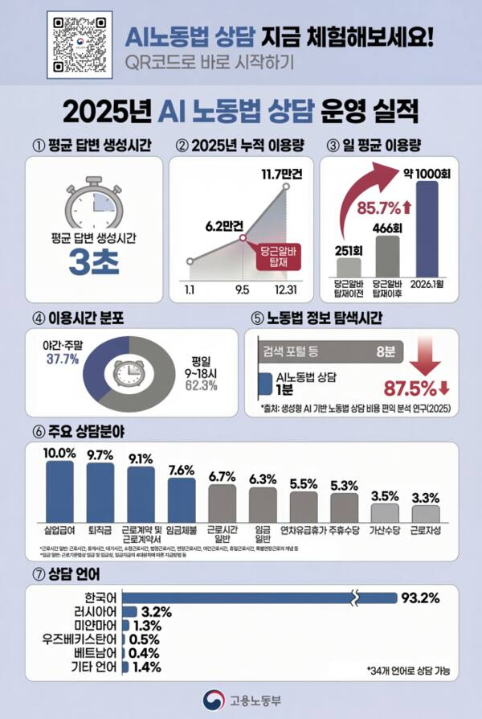

# 법령 검색 및 Q&A 챗봇 
> RAG + LLM + Django 기반 법률 Q&A 챗봇


본 프로젝트는 **법령 데이터를 기반으로 사용자의 질문에 근거 있는 답변을 제공하는 AI 챗봇 웹서비스**입니다.  
RAG(Retrieval-Augmented Generation) 구조를 적용하여, 실제 법령 조문을 검색한 뒤 LLM을 통해 답변을 생성합니다.

<br>

---
# 팀원 및 담당 업무


| 성함       | 담당 업무                                                    |
| :--------- | :----------------------------------------------------------- |
| **김준석** | RAG 기반 모델 구축 및 개선 |
| **문지영** | Django 프로젝트 구조 설계, 채팅 세션 관리  |
| **박내은** | AWS 기반 서비스 배포 및 운영 |
| **박민정** | 서비스 기획 및 기술 설계 산출물 전반 담당 |
| **유성현** | AWS 기반 서비스 배포 및 운영 |
| **전우영** | RAG 기반 모델 구축 및 개선 |

<br>

---


# 📑 목차
<br>

1. 프로젝트 개요
2. 기술 스택 & 사용한 모델
3. 시스템 아키텍쳐
4. 주요 기능
5. 수행 결과 (시연 페이지)
7. 프로젝트 개선 방향
8. 회고

<br>

---

# 📖 프로젝트 개요

### **프로젝트 정보**
- **프로젝트명**: 법령 검색 및 Q&A 챗봇 
- **개발 기간**: 3차(RAG 챗봇) + 4차(웹 서비스) 통합 프로젝트
- **팀 구성**: 6명
- **개발 환경**: Python 3.12+, SQLite


### **프로젝트 배경**

“노동법은 복잡하고 적용 사례도 다양하여 일반 노동자 및 사업주가 스스로 해결하기 어렵다는 현실이 존재한다. 실제로 정부가 AI 기반 노동법 상담 서비스를 도입해 11만7천건 이상의 상담이 이뤄진 사례도 보도되었으며, 노동법 개정 과정에서는 기업과 노동계 간 법 해석 논쟁이 확산되는 등 법의 실체적 이해가 어려운 상황이 드러났다.”



📎 출처: 고용노동부, 「AI 노동법 상담 운영 실적(2025)」

<br>

일반 사용자가 법령을 직접 검색하고 해석하는 것은 매우 어렵습니다.

- 법률 용어가 어렵고  
- 필요한 조문을 찾기 힘들며  
- 상황에 맞는 해석을 얻기 어렵기 때문입니다  

이를 해결하기 위해, **법령 데이터를 AI가 이해하고 설명해주는 챗봇 웹서비스**를 기획했습니다.

<br>

### **프로젝트 목표**

- 법령 데이터를 **조문 단위로 구조화**
- 벡터 검색 기반 **정확한 근거 제시**
- Django 기반 **웹 챗봇 UI 구현**
- 누구나 쉽게 사용할 수 있는 **법률 Q&A 서비스**


### **핵심 아이디어**

- 법률 분야를 노동법 / 사회복지법 / 형사법으로 분리
- 각 도메인별 전용 데이터와 벡터 DB 구축
- 공통 RAG 파이프라인을 활용해 정확한 근거 기반 응답 생성
- Django 웹 인터페이스를 통한 직관적인 챗봇 사용 경험 제공

<br>

---

# 🛠 기술 스택 & 사용한 모델


| 분야                | 사용 도구 |
|---------------------|-----------|
| **Language**        | [](https://www.python.org/) |
| **Collaboration Tool** | [](https://git-scm.com/) [](https://github.com/) [](https://discord.com/)
| **LLM Model** | [](https://platform.openai.com/) |
| **Embedding Model** | [](https://huggingface.co/Qwen/Qwen3-Embedding-0.6B) [](https://huggingface.co/BAAI/bge-m3) |
| **Reranker Model** | [](https://huggingface.co/jinaai/jina-reranker-v2-base-multilingual) |
| **Database** |   |
| **Library** |   |
| **Orchestration / RAG** | [](https://www.langchain.com/) [](https://langchain-ai.github.io/langgraph/) |
| **Frontend / Infra** |     |
| **Development Env** | [](https://code.visualstudio.com/) [](https://www.anaconda.com/) |
<br>


---

# 시스템 아키텍쳐

### 프로젝트 구조

```
SKN21-4TH-1TEAM/
├── chat/                            # Django 웹 애플리케이션 - 챗봇 화면 및 RAG 로직
│   ├── admin.py                    # Django 관리자 페이지 설정
│   ├── apps.py                     # chat 앱 설정 및 Ready 훅
│   ├── models.py                   # 채팅 데이터 모델 (ChatMessage)
│   ├── urls.py                     # URL 라우팅 설정
│   ├── views.py                    # 챗봇 요청 처리 및 응답 생성
│   ├── services.py                 # ChatbotService - RAG 파이프라인 관리
│   ├── migrations/                 # 데이터베이스 마이그레이션
│   │   ├── __init__.py
│   │   ├── 0001_initial.py         # 초기 모델 생성
│   │   └── 0002_chatmessage_session_id.py  # session_id 필드 추가
│   ├── templates/                  # HTML 템플릿
│   │   └── chat/
│   └── ai_module/                  # RAG 기반 챗봇 핵심 로직
│       ├── config.py               # 설정 및 하이퍼파라미터
│       ├── infrastructure.py       # 벡터 저장소, 리랭커 구현
│       ├── graph.py                # LLM 그래프 및 RAG 파이프라인
│       ├── prompts.py              # LLM 프롬프트 템플릿
│       └── schemas.py              # 데이터 스키마 정의
│
├── accounts/                        # Django 웹 애플리케이션 - 사용자 인증
│   ├── apps.py                     # accounts 앱 설정
│   ├── models.py                   # 사용자 관련 커스텀 모델 (필요시)
│   ├── urls.py                     # 인증 관련 URL 라우팅
│   ├── views.py                    # 로그인, 로그아웃, 회원가입 처리
│   └── templates/                  # 인증 HTML 템플릿
│       └── account/
│
├── home/                            # Django 웹 애플리케이션 - 홈화면
│   ├── apps.py                     # home 앱 설정
│   ├── views.py                    # 홈 페이지 렌더링
│   └── templates/                  # 홈 HTML 템플릿
│       └── home/
│
├── config/                          # Django 프로젝트 전역 설정
│   ├── asgi.py                     # ASGI 설정 (비동기 웹서버)
│   ├── settings.py                 # 프로젝트 설정 (DB, 앱, 미들웨어 등)
│   ├── urls.py                     # 전역 URL 라우팅
│   └── wsgi.py                     # WSGI 설정 (동기 웹서버)
│
├── templates/                       # 전역 HTML 템플릿
│   └── base.html                   # 기본 템플릿 (상속용)
│
├── manage.py                       # Django 실행 진입점
├── db.sqlite3                      # SQLite 데이터베이스
├── requirements.txt                # Python 의존성 목록
├── requirements_fixed.txt          # 고정된 버전의 의존성
└── Dockerfile                      # Docker 컨테이너 설정
```


---

# 🎯 프로젝트 실행

### 개발 환경

```bash
# 의존성 설치
pip install -r requirements.txt

# 마이그레이션 적용
python manage.py migrate

# 슈퍼유저 생성
python manage.py createsuperuser

# 서버 실행
python manage.py runserver
```

### 프로덕션 환경

```bash
# Gunicorn으로 실행
gunicorn config.wsgi:application --bind 0.0.0.0:8000

# 또는 Docker
docker build -t legal-chatbot .
docker run -p 8000:8000 legal-chatbot
```


### 환경 변수 (.env)

```bash
OPENAI_API_KEY=your_openai_api_key_here

# Django Settings
SERVICE_TARGET=dev
DJANGO_SECRET_KEY=your_django_secret_key_here

# Qdrant Settings
QDRANT_API_KEY=your_qdrant_api_key_here
QDRANT_URL=https://your-qdrant-instance.cloud.qdrant.io/
QDRANT_COLLECTION_NAME=your_collection_name

# LangSmith Settings
LANGCHAIN_ENDPOINT="https://api.smith.langchain.com"
LANGCHAIN_API_KEY=your_langsmith_api_key_here
LANGCHAIN_PROJECT="your_project_name"
LANGCHAIN_TRACING_V2=true

```

---


---

# ✨ **주요 기능**

## 1. 실제 법령 기반 질의응답
- 사용자의 질문을 자연어로 입력
- 관련 법령 조문을 벡터 검색
- 검색 결과를 기반으로 AI 답변 생성

## 2. 근거 중심 답변
- 단순 요약이 아닌 **관련 조문 포함 답변**
- 법령 출처 명시

## 3. 웹 챗봇 UI
- Django 기반 웹 페이지
- 실시간 채팅 형태의 UX
- 사용자 질문 / AI 답변 기록 유지
  
## 4. 요구사항

### 4.1 기능적 요구사항 (Functional Requirements)

| ID | 요구사항명 | 상세 설명 | 비고 |
| :--- | :--- | :--- | :--- |
| **F-01** | **사용자 인증** | Google OAuth 및 일반 이메일(ID/PW) 가입 기능을 모두 제공함. | Google OAuth 2.0 |
| **F-02** | **채팅 UI** | 실시간 질의응답이 가능한 웹 기반 채팅 인터페이스(UI/UX) 제공. | 반응형 웹 디자인 |
| **F-03** | **벡터&키워드 검색 + 리랭킹** | 2단계 검색으로 정확도 향상. | 3차 프로젝트보다 발전한 RAG 모듈 연동 |
| **F-04** | **대화 이력 저장** | 이메일 주소를 고유 식별자로 사용하여 대화 이력을 통합 관리/로드함. | 유저별 세션 관리 |
| **F-05** | **근거 법령 제시** | 답변의 신뢰성을 위해 참조한 법령 조문을 명확히 명시. | 출처 표시 기능 |

### 4.2 비기능적 요구사항 (Non-functional Requirements)

| ID | 구분 | 상세 설명 |
| :--- | :--- | :--- |
| **N-01** | **신뢰성** | 환각 현상 방지를 위해 검색된 법령 데이터 범위 내에서 답변을 생성하도록 프롬프트 제어. |
| **N-02** | **가용성** | AWS EC2 인프라를 활용하여 안정적인 서비스 접속 환경 유지. |
| **N-03** | **성능** | 질문 입력 후 답변 생성 시작까지 최대 10초 이내 수행 (Streaming 처리 권장). |

---

# 수행 결과 (시연 페이지)


---

# 🚀 프로젝트 개선 방향

- [ ] 추가 법률 도메인 (형사법, 사회복지법 등)
- [ ] 실시간 알림 기능 (WebSocket)
- [ ] 고급 검색 필터
- [ ] 사용자 피드백 수집 및 모델 개선
- [ ] 관리자 대시보드 (통계, 질문 분석)
- [ ] 멀티 언어 지원

---

# 📝 회고

| 성함       | 회고                                                           |
| :--------- | :----------------------------------------------------------- |
| **김준석** |  |
| **문지영** |  |
| **박내은** |  |
| **박민정** |  |
| **유성현** |  |
| **전우영** |  |

