# 🚀 Django 초보자를 위한 완벽 가이드

> Django가 처음이라면 이 문서를 읽어보세요! 디렉토리 구조와 동작 원리를 쉽게 설명합니다.

---

## 📚 Django란?

Django는 **Python 웹 프레임워크**입니다. 웹사이트를 만들 때 필요한 기본 기능들을 제공해줍니다.

**비유**: 집을 지을 때 벽돌부터 하나하나 만들지 않고, 이미 만들어진 자재를 조립하는 것처럼!

---

## 🏗️ Django의 핵심 개념: MVT 패턴

Django는 **MVT (Model-View-Template)** 패턴을 사용합니다.

```mermaid
graph LR
    User[사용자] --> URL[URL]
    URL --> View[View<br/>로직 처리]
    View --> Model[Model<br/>데이터베이스]
    View --> Template[Template<br/>HTML]
    Template --> User
```



### 1. **Model** (모델) - 데이터베이스
- 데이터를 저장하는 구조
- 예: 사용자 정보, 채팅 메시지 등
- 파일: [models.py](file:///Users/junseok/Projects/SKN21-4th-1Team/chat/models.py)

### 2. **View** (뷰) - 로직 처리
- 사용자 요청을 받아서 처리
- 데이터를 가져오고, 계산하고, 응답 생성
- 파일: [views.py](file:///Users/junseok/Projects/SKN21-4th-1Team/chat/views.py)

### 3. **Template** (템플릿) - HTML
- 사용자에게 보여줄 화면
- HTML + Django 템플릿 문법
- 폴더: `templates/`

---

## 📁 Django 프로젝트 구조 완벽 이해

### 전체 구조 한눈에 보기

```
SKN21-4th-1Team/              ← 프로젝트 루트
│
├── manage.py                 ← Django 명령어 실행 (서버 시작 등)
├── db.sqlite3                ← 데이터베이스 파일
├── requirements.txt          ← 필요한 패키지 목록
│
├── config/                   ← 프로젝트 설정 폴더
│   ├── settings.py           ← 전체 설정 (DB, 앱 등록 등)
│   ├── urls.py               ← 메인 URL 라우팅
│   ├── wsgi.py               ← 배포용 설정
│   └── asgi.py               ← 비동기 배포용 설정
│
├── chat/                     ← 앱 1: 채팅 기능
├── criminal/                 ← 앱 2: 형사법 챗봇
├── home/                     ← 앱 3: 홈페이지
└── accounts/                 ← 앱 4: 계정 관리
```

---

## 🎯 핵심 파일 설명

### 1. [manage.py](file:///Users/junseok/Projects/SKN21-4th-1Team/manage.py) - Django의 만능 도구

**역할**: Django 명령어를 실행하는 스크립트

**자주 사용하는 명령어**:
```bash
# 서버 실행
python manage.py runserver

# 데이터베이스 마이그레이션
python manage.py migrate

# 관리자 계정 생성
python manage.py createsuperuser

# 앱 생성
python manage.py startapp 앱이름
```

---

### 2. `config/` - 프로젝트 설정 폴더

#### [settings.py](file:///Users/junseok/Projects/SKN21-4th-1Team/config/settings.py) - 전체 설정
```python
# 설치된 앱 등록
INSTALLED_APPS = [
    'django.contrib.admin',      # 관리자 페이지
    'django.contrib.auth',       # 인증 시스템
    'chat',                      # 우리가 만든 앱
    'criminal',                  # 우리가 만든 앱
]

# 데이터베이스 설정
DATABASES = {
    'default': {
        'ENGINE': 'django.db.backends.sqlite3',
        'NAME': BASE_DIR / 'db.sqlite3',
    }
}

# 시크릿 키 (보안용)
SECRET_KEY = 'django-insecure-...'
```

#### [urls.py](file:///Users/junseok/Projects/SKN21-4th-1Team/chat/urls.py) - URL 라우팅 (교통 정리)
```python
urlpatterns = [
    path('admin/', admin.site.urls),           # /admin/ → 관리자 페이지
    path('', include('home.urls')),            # / → home 앱
    path('chat/', include('chat.urls')),       # /chat/ → chat 앱
    path('criminal/', include('criminal.urls')), # /criminal/ → criminal 앱
]
```

**동작 방식**:
```
사용자가 http://localhost:8000/chat/ 접속
  → config/urls.py에서 'chat/' 찾음
  → chat/urls.py로 이동
  → chat/views.py의 함수 실행
```

---

### 3. Django 앱 구조 (예: [chat/](file:///Users/junseok/Projects/SKN21-4th-1Team/chat/views.py#25-31))

Django에서 **앱**은 **특정 기능을 담당하는 모듈**입니다.

```
chat/                          ← 앱 폴더
├── __init__.py                ← Python 패키지 표시
├── admin.py                   ← 관리자 페이지 설정
├── apps.py                    ← 앱 설정
├── models.py                  ← 데이터베이스 모델
├── views.py                   ← 로직 처리 (핵심!)
├── urls.py                    ← 앱 내부 URL 라우팅
├── tests.py                   ← 테스트 코드
├── migrations/                ← 데이터베이스 변경 기록
└── templates/                 ← HTML 템플릿
    └── chat/
        └── chat.html
```

#### 각 파일의 역할

##### [models.py](file:///Users/junseok/Projects/SKN21-4th-1Team/chat/models.py) - 데이터베이스 설계
```python
from django.db import models

class ChatMessage(models.Model):
    role = models.CharField(max_length=10)  # "user" 또는 "ai"
    message = models.TextField()            # 메시지 내용
    created_at = models.DateTimeField(auto_now_add=True)  # 생성 시간
```

**의미**: 
- [ChatMessage](file:///Users/junseok/Projects/SKN21-4th-1Team/chat/models.py#4-16)라는 테이블 생성
- 3개의 컬럼: role, message, created_at

##### [views.py](file:///Users/junseok/Projects/SKN21-4th-1Team/chat/views.py) - 로직 처리 (가장 중요!)
```python
from django.shortcuts import render
from django.http import JsonResponse

def chat(request):
    # GET 요청: 채팅 화면 보여주기
    if request.method == 'GET':
        return render(request, 'chat/chat.html')

def chat_api(request):
    # POST 요청: 메시지 처리
    user_message = request.POST.get('message')
    ai_answer = ask_openai(user_message)  # AI 호출
    
    # DB에 저장
    ChatMessage.objects.create(role='user', message=user_message)
    ChatMessage.objects.create(role='ai', message=ai_answer)
    
    # JSON 응답
    return JsonResponse({'reply': ai_answer})
```

**동작 흐름**:
1. 사용자가 `/chat/` 접속 → `chat()` 함수 실행 → HTML 반환
2. 사용자가 메시지 전송 → `chat_api()` 함수 실행 → AI 답변 반환

##### `urls.py` - 앱 내부 URL 설정
```python
from django.urls import path
from . import views

urlpatterns = [
    path('', views.chat, name='chat'),           # /chat/ → chat() 함수
    path('api/', views.chat_api, name='chat_api'),  # /chat/api/ → chat_api() 함수
]
```

##### `templates/` - HTML 파일
```html
<!-- chat/templates/chat/chat.html -->
<!DOCTYPE html>
<html>
<head>
    <title>채팅</title>
</head>
<body>
    <h1>AI 챗봇</h1>
    <div id="chat-box">
        
            <p><strong>{{ role }}:</strong> {{ message }}</p>
        
    </div>
</body>
</html>
```

**Django 템플릿 문법**:
- `{{ 변수 }}`: 변수 출력
- ``: 반복문
- ``: 조건문

---

## 🔄 Django 요청-응답 흐름

### 예시: 사용자가 `/chat/` 접속

```mermaid
sequenceDiagram
    participant User as 사용자
    participant Browser as 브라우저
    participant Django as Django 서버
    participant View as views.py
    participant Template as chat.html
    
    User->>Browser: http://localhost:8000/chat/ 입력
    Browser->>Django: GET /chat/
    Django->>Django: config/urls.py 확인
    Django->>Django: chat/urls.py 확인
    Django->>View: chat() 함수 실행
    View->>Template: render('chat.html')
    Template->>View: HTML 생성
    View->>Browser: HTML 응답
    Browser->>User: 화면 표시
```



### 상세 단계

1. **URL 매칭**
   ```
   /chat/ 요청
   → config/urls.py: path('chat/', include('chat.urls'))
   → chat/urls.py: path('', views.chat)
   → chat/views.py의 chat() 함수 실행
   ```

2. **View 실행**
   ```python
   def chat(request):
       # 로직 처리
       data = ChatMessage.objects.all()  # DB에서 데이터 가져오기
       return render(request, 'chat/chat.html', {'messages': data})
   ```

3. **Template 렌더링**
   ```html
   
       <p>{{ msg.message }}</p>
   
   ```

4. **응답 반환**
   - HTML을 브라우저에 전송
   - 사용자가 화면을 봄

---

## 📊 데이터베이스 작업 (ORM)

Django는 **ORM (Object-Relational Mapping)**을 사용합니다.
→ SQL을 직접 쓰지 않고 Python 코드로 DB 조작!

### 예시

#### SQL (전통적인 방법)
```sql
INSERT INTO chat_message (role, message, created_at) 
VALUES ('user', '안녕하세요', NOW());
```

#### Django ORM (쉬운 방법)
```python
ChatMessage.objects.create(
    role='user',
    message='안녕하세요'
)
```

### 자주 사용하는 ORM 명령어

```python
# 생성
ChatMessage.objects.create(role='user', message='안녕')

# 조회 (전체)
messages = ChatMessage.objects.all()

# 조회 (필터)
user_messages = ChatMessage.objects.filter(role='user')

# 조회 (하나만)
msg = ChatMessage.objects.get(id=1)

# 수정
msg.message = '수정된 메시지'
msg.save()

# 삭제
msg.delete()
```

---

## 🛠️ 마이그레이션 (Migration)

**마이그레이션**: 데이터베이스 구조를 변경하는 작업

### 워크플로우

1. **모델 수정** (`models.py`)
   ```python
   class ChatMessage(models.Model):
       role = models.CharField(max_length=10)
       message = models.TextField()
       created_at = models.DateTimeField(auto_now_add=True)
       # 새 필드 추가!
       user = models.ForeignKey(User, on_delete=models.CASCADE)
   ```

2. **마이그레이션 파일 생성**
   ```bash
   python manage.py makemigrations
   ```
   → `migrations/0002_chatmessage_user.py` 생성

3. **마이그레이션 적용**
   ```bash
   python manage.py migrate
   ```
   → 실제 DB에 테이블 변경 적용

---

## 🎨 정적 파일 (Static Files)

CSS, JavaScript, 이미지 등은 `static/` 폴더에 저장합니다.

### 구조
```
chat/
├── static/
│   └── chat/
│       ├── style.css
│       ├── script.js
│       └── logo.png
└── templates/
    └── chat/
        └── chat.html
```

### 사용 방법
```html

<!DOCTYPE html>
<html>
<head>
    <link rel="stylesheet" href="">
</head>
<body>
    
    <script src=""></script>
</body>
</html>
```

---

## 🔐 관리자 페이지 (Admin)

Django는 자동으로 관리자 페이지를 제공합니다!

### 설정 방법

1. **모델 등록** (`admin.py`)
   ```python
   from django.contrib import admin
   from .models import ChatMessage
   
   @admin.register(ChatMessage)
   class ChatMessageAdmin(admin.ModelAdmin):
       list_display = ['role', 'message', 'created_at']
       list_filter = ['role', 'created_at']
       search_fields = ['message']
   ```

2. **관리자 계정 생성**
   ```bash
   python manage.py createsuperuser
   ```

3. **접속**
   - URL: http://localhost:8000/admin/
   - 로그인 후 데이터 관리 가능!

---

## 🌐 이 프로젝트의 구조 다시 보기

이제 디렉토리가 이해되시나요?

```
SKN21-4th-1Team/
│
├── manage.py              ← 서버 실행: python manage.py runserver
│
├── config/                ← 프로젝트 전체 설정
│   ├── settings.py        ← 앱 등록, DB 설정
│   └── urls.py            ← 메인 URL 라우팅
│
├── chat/                  ← 노동법 챗봇 앱
│   ├── models.py          ← ChatMessage 모델
│   ├── views.py           ← 채팅 로직 (OpenAI 호출)
│   ├── urls.py            ← /chat/, /chat/api/
│   └── templates/         ← 채팅 화면 HTML
│
├── criminal/              ← 형사법 RAG 챗봇 앱
│   ├── views.py           ← RAG 로직
│   ├── urls.py            ← /criminal/
│   ├── services/          ← RAG 파이프라인
│   │   ├── rag_service.py ← LangChain 체인
│   │   └── store.py       ← Qdrant 벡터 DB
│   └── templates/         ← 형사법 챗봇 HTML
│
├── home/                  ← 홈페이지 앱
│   ├── views.py           ← 메인 페이지 로직
│   └── templates/         ← 메인 페이지 HTML
│
└── accounts/              ← 계정 관리 앱
    ├── views.py           ← 로그인/로그아웃
    └── urls.py            ← /accounts/
```

---

## 🚀 실전 예제: 새로운 페이지 추가하기

**목표**: `/about/` 페이지 만들기

### 1단계: 앱 생성
```bash
python manage.py startapp about
```

### 2단계: 앱 등록 (`config/settings.py`)
```python
INSTALLED_APPS = [
    # ...
    'about',  # 추가!
]
```

### 3단계: View 작성 (`about/views.py`)
```python
from django.shortcuts import render

def about_page(request):
    return render(request, 'about/about.html')
```

### 4단계: URL 설정 (`about/urls.py` 생성)
```python
from django.urls import path
from . import views

urlpatterns = [
    path('', views.about_page, name='about'),
]
```

### 5단계: 메인 URL 연결 (`config/urls.py`)
```python
urlpatterns = [
    # ...
    path('about/', include('about.urls')),
]
```

### 6단계: 템플릿 생성 (`about/templates/about/about.html`)
```html
<!DOCTYPE html>
<html>
<head>
    <title>소개</title>
</head>
<body>
    <h1>프로젝트 소개</h1>
    <p>법령 검색 챗봇입니다!</p>
</body>
</html>
```

### 7단계: 서버 실행 및 확인
```bash
python manage.py runserver
```
→ http://localhost:8000/about/ 접속!

---

## 📚 핵심 요약

### Django의 핵심 흐름
```
URL → View → Model/Template → Response
```

### 주요 파일
- `manage.py`: Django 명령어 실행
- `settings.py`: 전체 설정
- `urls.py`: URL 라우팅
- `models.py`: 데이터베이스
- `views.py`: 로직 처리
- `templates/`: HTML

### 자주 사용하는 명령어
```bash
python manage.py runserver        # 서버 실행
python manage.py makemigrations   # 마이그레이션 생성
python manage.py migrate          # 마이그레이션 적용
python manage.py createsuperuser  # 관리자 계정 생성
python manage.py startapp 앱이름   # 새 앱 생성
```

---

## 🎓 다음 단계

1. ✅ Django 공식 튜토리얼: https://docs.djangoproject.com/ko/
2. ✅ 직접 간단한 앱 만들어보기
3. ✅ 이 프로젝트 코드 읽으며 이해하기
4. ✅ 새로운 기능 추가해보기

Django는 처음엔 복잡해 보이지만, 구조를 이해하면 매우 강력한 도구입니다! 🚀
