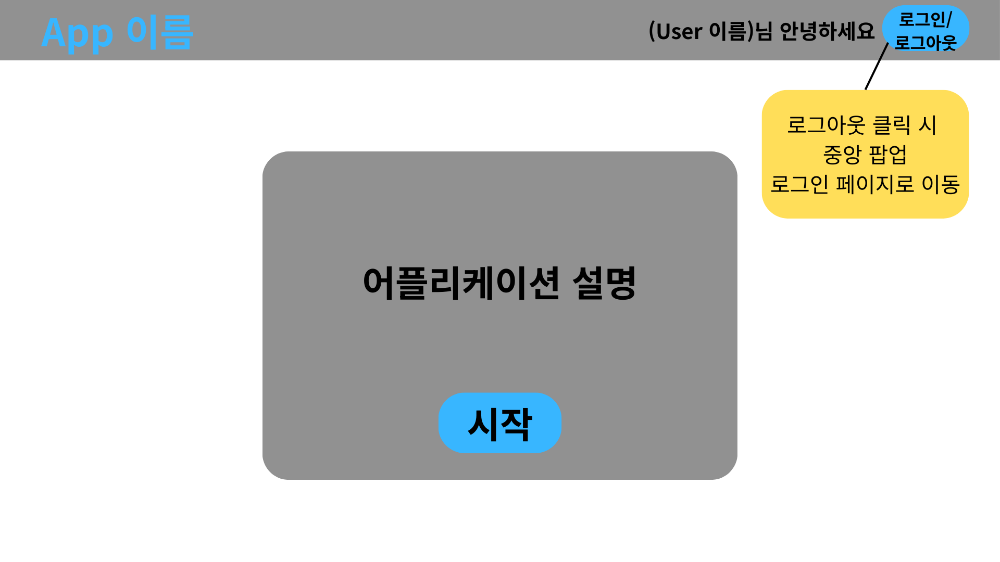
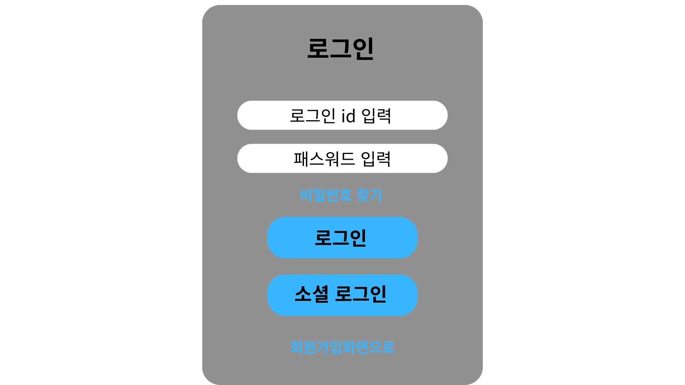
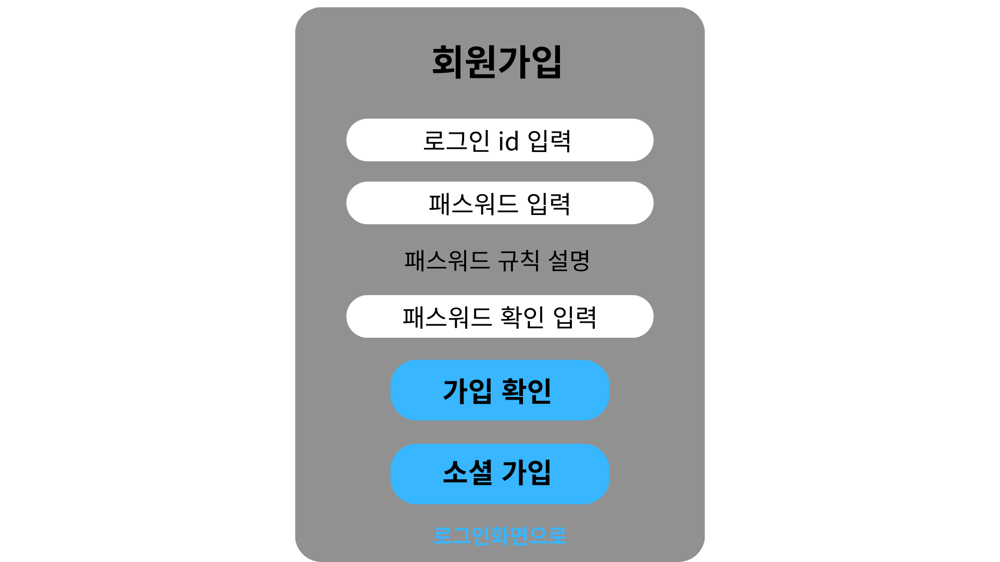
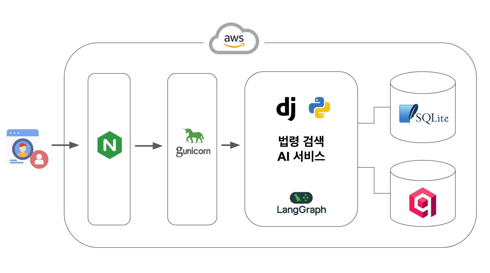

# 📂 프로젝트 문서 (Docs)

이 디렉토리는 **[SKN21-4th-1Team] 법률 가이드봇** 프로젝트의 기획 문서와 디자인 리소스를 포함하고 있습니다.

## 1. [요구사항 정의서](요구사항정의서.md)
*   **프로젝트 개요**: 일반인 대상 쉬운 법률 Q&A 챗봇.
*   **주요 기능**: 사용자 인증(Google OAuth), 실시간 채팅, RAG 기반 법률 질의응답, 대화 이력 관리.
*   **기술 스택**: Django, Docker, Qdrant, OpenAI/LLM API.
*   **시스템 아키텍처 및 데이터 정책** 포함.

---

## 2. 화면 설계도 (UI Design)

프로젝트의 주요 화면 구성입니다.

|          **메인 홈 (Home)**          |           **로그인 (Login)**           |
| :----------------------------------: | :------------------------------------: |
|  |  |
|       서비스 소개 및 시작 화면       |       사용자 인증 및 소셜 로그인       |

|         **채팅 화면 (Chat)**         |       **마이페이지/계정 (Account)**        |
| :----------------------------------: | :----------------------------------------: |
|  |  |
|      법률 질의응답 및 사이드바       |               계정 정보 관리               |

---

## 3. 시스템 구성도 (Architecture)

## 4. 테스트 계획서 및 테스트 결과보고서